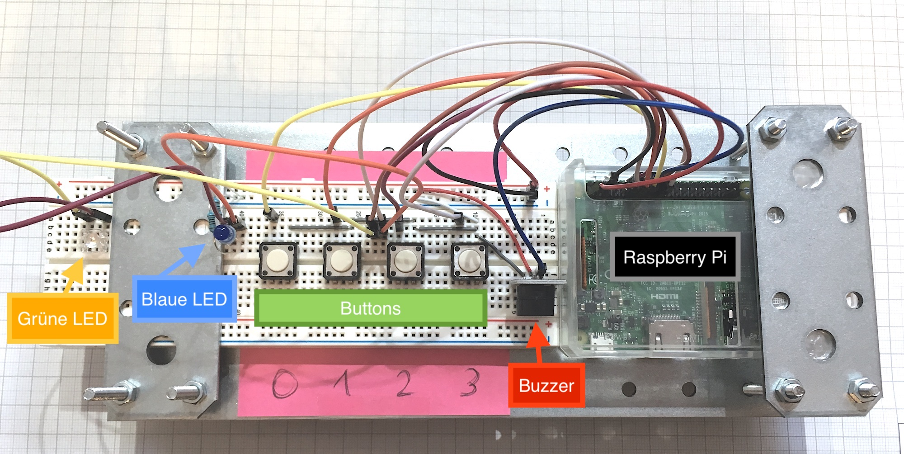

# VISPAR - Beschreibung des Demonstrators

Der Demonstrator, der während des Projektes im Rahmen der Implementierungsphase entworfen wurde, soll dazu dienen, die
Funktionsweise des gesamten Produktes zu demonstrieren. In diesem Dokument sollen Instruktionen gegeben werden, die es
ermöglichen, VISPAR Server und VISPAR Client auszuführen und einfache Muster zu entwerfen und zu aktivieren.

## Benötigte Komponenten

Der Demonstrator besteht aus den folgenden Teilen:

- 2x Raspberry Pi 3
  - ein Raspberry Pi dient als Server, der andere verfügt über Sensoren und Aktoren.
- 1x oder 2x Android Smartphone (Achtung: Achte darauf, dass Android API >= 21 verwendet wird)
- Netzwerk über WLAN

### Aufbau

Um Sensoren abzufragen bzw. Aktoren zu betätigen, kommen in unserem Fall
ausschließlich GPIO Pins zum Einsatz, die jeweils als Input bzw. Output
konfiguriert sind. Es werden die internen Pull-Up Widerstände des Raspberry Pi
verwendet. Wünscht man jedoch eine höhere Resistenz gegenüber äußeren Störungen,
sollte ein Aufbau mit dedizierten Widerständen eingesetzt werden. Prinzipiell
können alle GPIO Pins des Raspberry Pi verwendet werden, solange die Dateien
_buttons.py_ bzw. _socket.js_ dementsprechend angepasst werden.

_Unser beispielhafter Aufbau:_


#### Pinbelegung (Board-Nummerierung)

| Pin    | Modus    | Verwendung   |
| ------ | -------- | ------------ |
| 1      | -        | 3v3 Vcc      |
| 6      | -        | GND          |
| 11     | In       | Button 3     |
| 12     | In       | Button 2     |
| 13     | In       | Button 1     |
| 15     | In       | Button 0     |
| 16     | Out      | Buzzer       |
| 18     | Out      | LED Grün     |
| 19     | Out      | LED Blau     |


### Konfiguration

#### Server

Um den Server zu konfigurieren, ist Zugriff auf die Konsole des Raspberry Pi erforderlich, der als Server dienen soll.
Der Zugriff kann beispielsweise per SSH erfolgen.

Zur Inbetriebnahme des Servers ist die _\*.jar_-Datei der Server-Anwendung in einem beliebigen Verzeichnis auf dem Pi
abzulegen. Im gleichen Verzeichnis muss ein Verzeichnis mit dem Namen "*sensors*" existieren. Aus diesem Verzeichnis
lädt der Server die Konfigurationsdateien für die zu verwaltenden Sensoren (das Format der Konfigurationsdateien ist
in einer separaten Datei beschrieben). In das Verzeichnis werden die Dateien *button*[*0*,...,*3*]*.conf* abgelegt, welche
die auf dem zweiten Pi verbauten Sensoren im Server konfigurieren.  
Des Weiteren muss auf dem Server eine MongoDB-Installation aktiv sein. Installiere hierzu über die Paketverwaltung das
Paket `mongodb-org-server`. Eventuell ist ein Neustart des Rechners erforderlich.  
Sollen E-Mail-Actions verwendet werden, muss zudem eine Postfix-Installation vorhanden und aktiv sein.

Eine ausführliche Anleitung befindet sich in der Datei *docs/rpi-install.md*.

Um die Server-Anwendung zu starten, führe den Befehl `java -jar vispar-server.jar` aus. `vispar-server.jar` ist hierbei
der Name des _*.jar_-Pakets, in welchem sich die Anwendung befindet.

#### Sensoren

Der zweite Raspberry Pi ist mit 4 Tastschaltern versehen und sendet bei Betätigung eines Tasters jeweils ein Ereignis
an den Server. Hierzu muss auf dem Pi das Skript *buttons.py* ausgeführt werden. In der Skriptdatei wird hierzu die
IP-Adresse durch die des Servers ersetzt. Zum Ausführen wird eine funktionsfähige Python 3 Installation benötigt. Das
Skript kann dann über den Befehl `python3 buttons.py` ausgeführt werden.

Sollen die verbauten LEDs durch spezielle Socket-Nachrichten (bei Socket-Actions) aktiviert werden, muss zusätzlich
das Skript *socket.js* ausgeführt werden. Beachte, dass die Socket-Verbindung nach einigen Minuten der Inaktivität
abbricht. In diesem Fall muss das Skript neugestartet werden.
Zur Ausführung wird Node JS 8 oder neuer benötigt. Zusätzlich müssen folgende
Befehle zusätzlich im Ordner, in welchem das Skript liegt, einmalig ausgeführt werden:
`npm install rpi-gpio` und `npm install ws`. Das Skript kann dann mittels
`node socket.js` gestartet werden. (Die IP-Adresse des Servers sollte auch hier
zuvor eingetragen werden).

Achte auf eine funktionsfähige Netzwerkverbindung zum Server.

Folgende Socket-Aktionen sind in _socket.js_ implementiert:
```
led.blue.[time]         // aktiviere blaue LED für [time] ms
led.green.[time]        // aktiviere grüne LED für [time] ms
buzzer.[time]           // aktiviere Buzzer für [time] ms

Beispiel: led.blue.1000     // aktiviert die blaue LED für 1000ms
```

#### Client

Installiere zunächst die signierte _*.apk_-Datei des Clients auf einem oder zwei Android-Smartphones. Beachte, dass
die App die Android-API Version 21 oder neuer erfordert.

Achte auf eine funktionsfähige Netzwerkverbindung zum Server.

Starte die Client-App auf dem Smartphone. Es öffnet sich ein Login-Bildschirm. Beachte bei der Eingabe der Serveradresse,
dass das Protokoll (i.d.R. *http://*) sowie der Port (i.d.R. *8080*) angegeben werden muss. Die Adresse hat also die
Form `http://<server-ip>:8080`.
